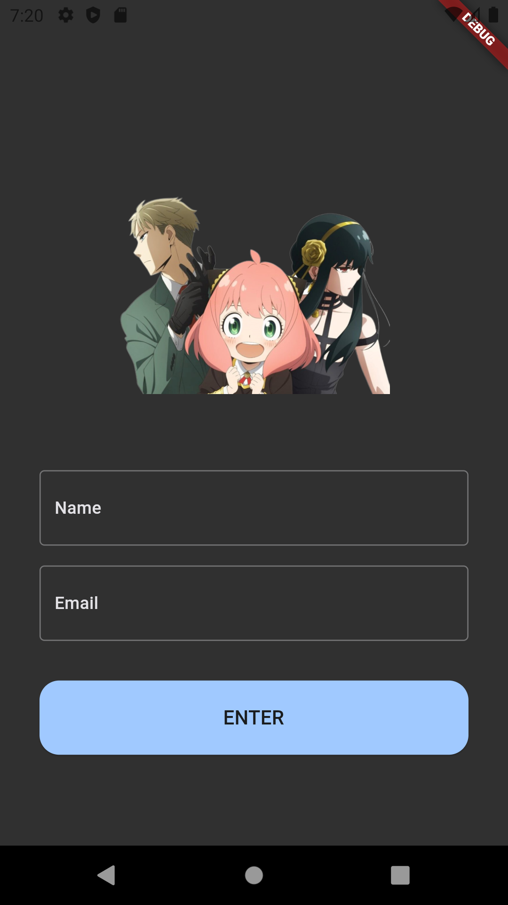
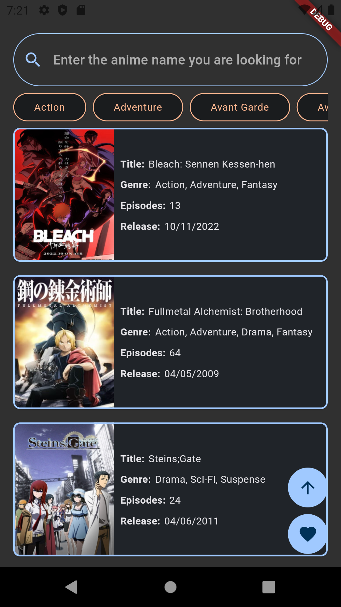
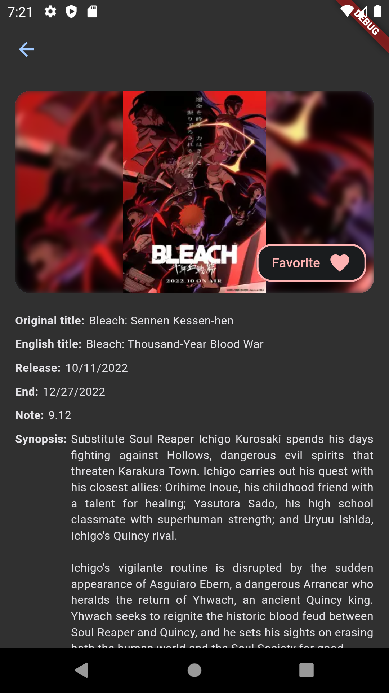
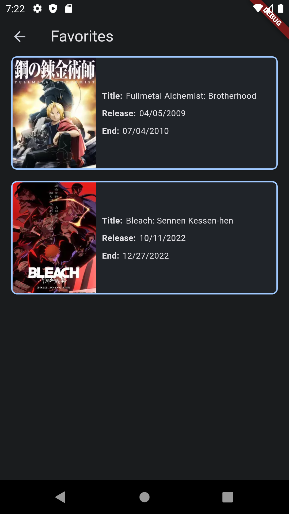

# Animes

Aplicativo Flutter

## Principais dependências

- Navegação: [GoRouter](https://pub.dev/packages/go_router)
- Injeção de dependência: [Provider](https://pub.dev/packages/provider)
- Chamadas de rede: [Dio](https://pub.dev/packages/dio)
- Persistência de dados: [Hive](https://pub.dev/packages/hive)
- Gerenciamento de estado: [Flutter Triple](https://pub.dev/packages/flutter_triple)

## Sobre

- O aplicativo possui modularização
- Possui internacionalização de strings, onde cada feature é responsável pelas suas strings utilizadas, além do módulo core possuir strings compartilhadas no projeto
- É destinado um módulo para o design system do aplicativo
- O aplicativo possui a implementação do [Widgetbook](https://www.widgetbook.io/), facilitando testar visualmente os componentes do Design System isoladamente
- Contém a classe [Result](https://github.com/alvarobcprado/animes_app/blob/main/modules/core/lib/src/commons/result.dart), que tem como objetivo empacotar os dados retornados deixando com que cada camada lide responsavelmente com as possíveis falhas
- Possui testes unitários, utilizando [Mocktail](https://pub.dev/packages/mocktail)

## Arquitetura

O aplicativo segue o padrão MVVM + Clean Architecture contendo os seguintes módulos:

- App: Responsável pela inicialização do aplicativo 
- Core: Módulo que contém código compartilhado e todas as dependências utilizadas no projeto
- Data Local: Módulo responsável por salvar e obter as informações salvas localmente
- Dependency Injection: Responsável pela injeção de dependência do aplicativo. Este módulo conhece todos os outros
- Design System: Módulo independente que contém as cores, tipografias e os componentes reutilizáveis de UI
- Feature Auth: Módulo responsável pela tela de login
- Feature Home: Módulo responsável pelas telas de listagem de animes, detalhes de um anime clicado e animes favoritados
- Navigation: Responsável pela navegação entre as features (qualquer módulo feature tem acesso a este módulo). Cada feature pode possuir uma interface de navegação, como por exemplo: a [AuthBoundary](https://github.com/alvarobcprado/animes_app/blob/main/modules/navigation/lib/src/auth_boundary.dart) é uma interface que contém um método para navegação da Feature Auth para Feature Home. Sendo assim, cada feature é responsável pela implementação da navegação de outra feature para a sua própria feature (neste caso temos a [AuthBoundaryImpl](https://github.com/alvarobcprado/animes_app/blob/main/modules/feature_home/lib/src/boundary/auth_boundary_impl.dart) contida na Feature Home)

## Telas

- Login
- Listagem de animes: Tela que exibe por paginação uma lista de animes (aleatórios, por busca ou por categoria)
- Detalhes de um anime: Apresenta os detalhes de um anime clicado na tela anterior. Nesta tela é possível favoritar/desfavoritar um anime
- Animes favoritados: Tela que exibe os animes favoritados do usuário

# 

   
